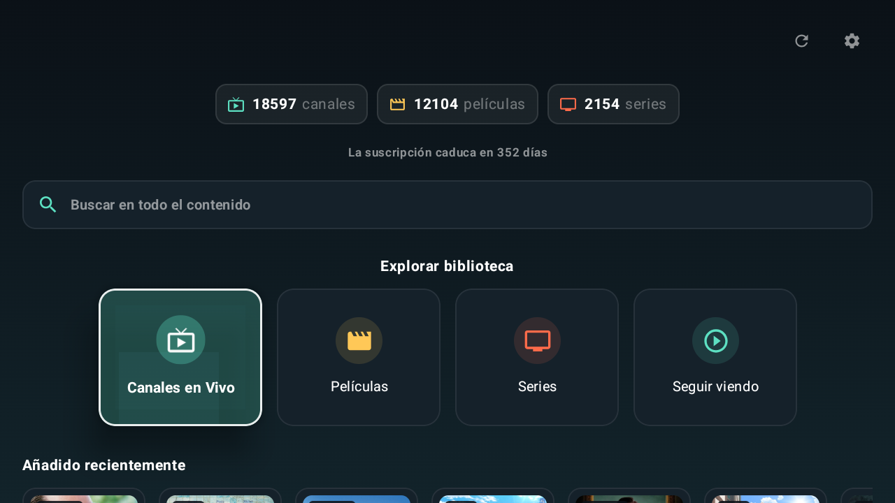
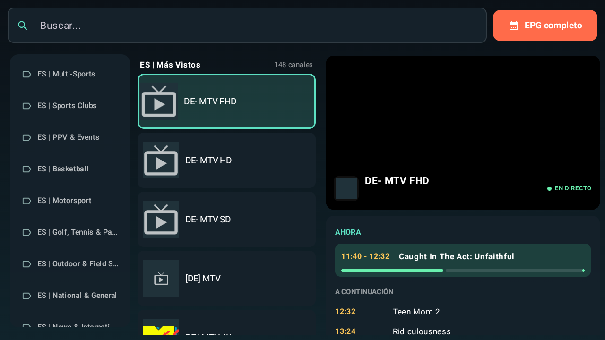
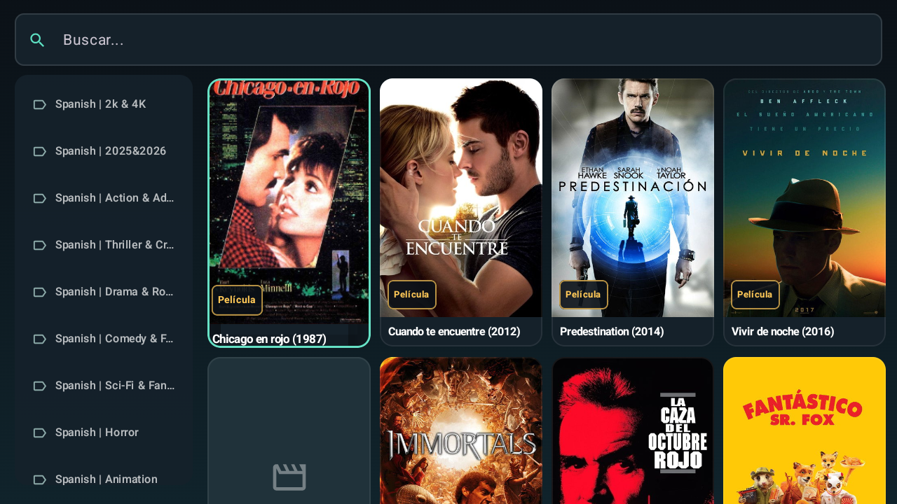
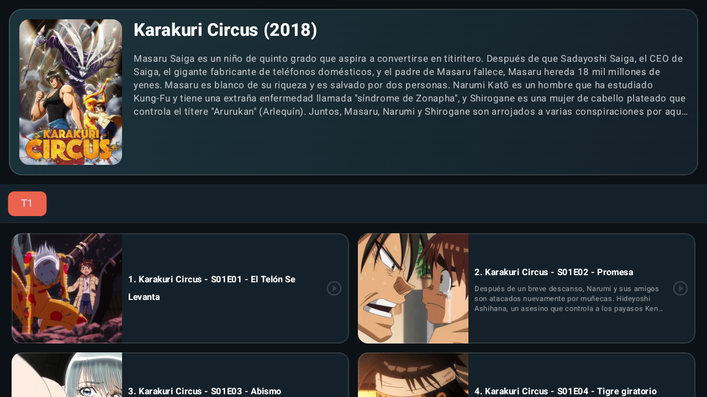
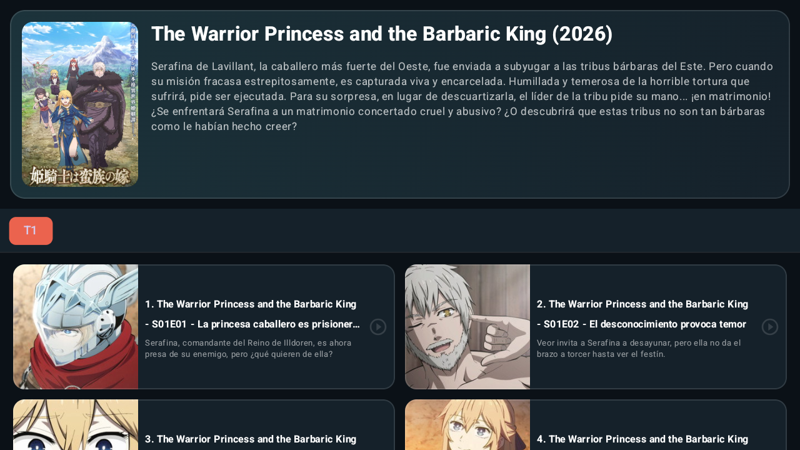
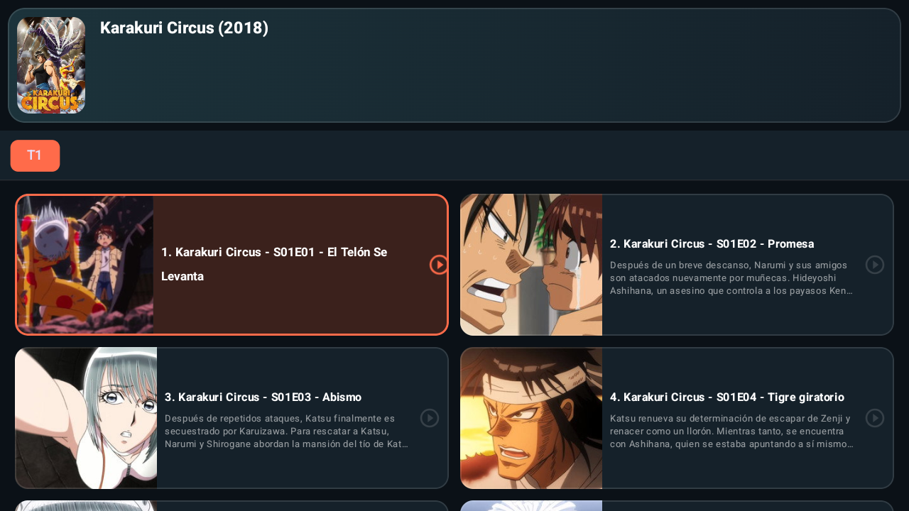
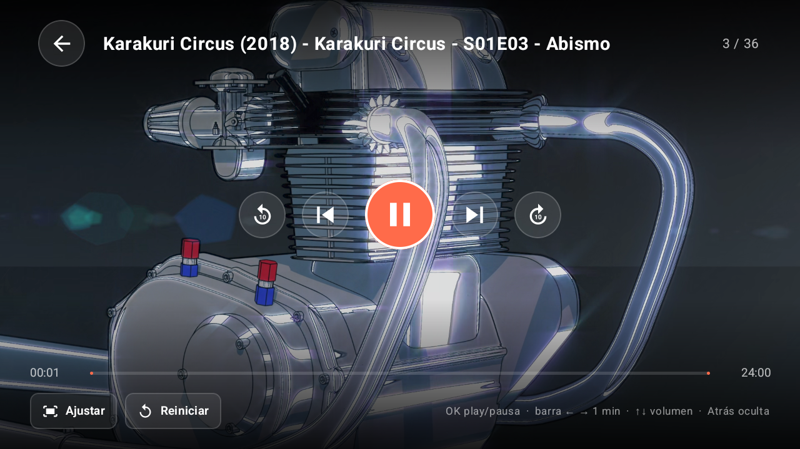
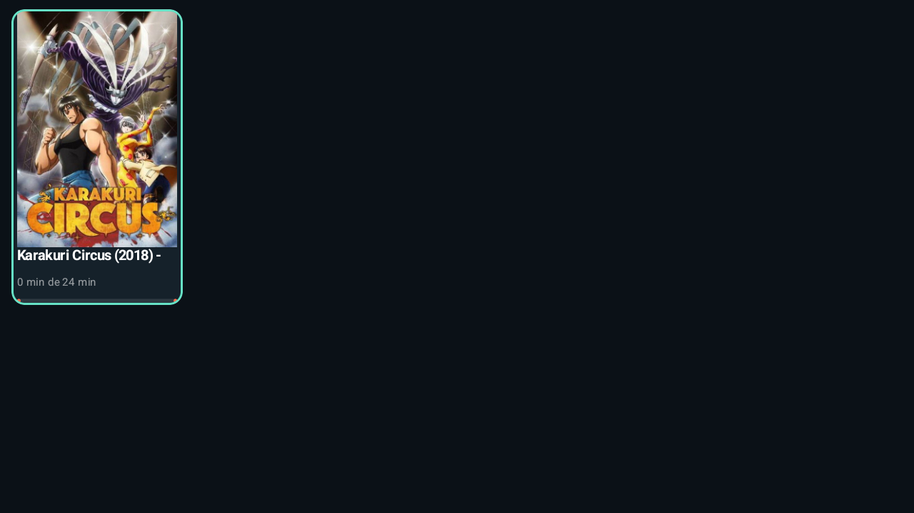
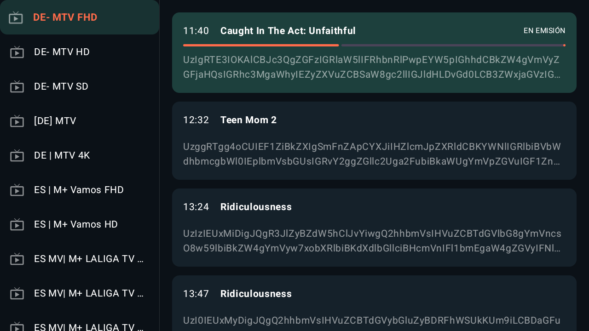

# Nova IPTV — app nativa Android TV (Kotlin)

Aplicación IPTV nativa para Android TV escrita desde cero en Kotlin con
Jetpack Compose y Compose for TV. Diseñada para usarse íntegramente con el
mando a distancia (D-pad, OK, Atrás y botones de color), con navegación por
foco, animaciones y reproductor propio sobre Media3 ExoPlayer.

- `applicationId`: `com.algoce95.novaiptv`
- `minSdk` 26 · `targetSdk` 36 · lanzador LEANBACK (Android TV)

## Funcionalidades

### Inicio de sesión y cuenta
- Login contra servidor Xtream Codes (URL, usuario y contraseña).
- Credenciales cifradas con AES-GCM usando claves del Android Keystore
  (`CredentialStore`); no se guardan en texto plano.
- Indicador de caducidad de la suscripción en el dashboard, con color según
  los días restantes.
- Splash animado y carga progresiva del catálogo (canales, películas y series
  se cargan e indican su estado por separado).

### Dashboard
- Contadores de canales, películas y series disponibles para el usuario.
- Búsqueda global sobre todo el contenido (canales + películas + series) con
  pantalla de resultados dedicada.
- Carrusel "Añadido recientemente" (películas y series más nuevas).
- Acceso directo a las cuatro secciones y a Ajustes.

### Canales en vivo
- Listado de canales con sidebar de categorías (incluida una categoría
  virtual de Favoritos) y contador de canales por categoría.
- Búsqueda dentro de la vista en vivo.
- Panel de previsualización 16:9 con overlay del canal (logo, nombre,
  categoría, indicador EN DIRECTO).
- EPG integrado por canal: programa "AHORA" con barra de progreso en vivo,
  y "A CONTINUACIÓN" con los siguientes programas.
- Guía EPG completa a pantalla completa (parrilla de canales × horarios).
- Favoritos: añadir/quitar desde el canal y reordenar con el D-pad.
- Sugerencias de arranque basadas en los favoritos.

### Películas y Series
- Cuadrícula de pósters con categoría seleccionable y búsqueda que recorre
  todas las categorías visibles (no solo la seleccionada).
- La búsqueda se reinicia al salir y volver a entrar de la sección.
- Detalle de película con sinopsis, metadatos y reproducción directa.
- Detalle de serie con temporadas (chips ordenados), episodios con
  miniatura, título y sinopsis; cabecera que se compacta automáticamente al
  acceder a los episodios para dejar más espacio visual a los capítulos.
- Reproducción de un episodio concreto o continuación desde el último visto.

### Seguir viendo
- Progreso de visionado guardado por contenido (canal, película o episodio).
- Tarjetas con póster, tiempo visto/total y barra de progreso.
- Eliminar elementos de la lista desde la propia vista.

### Reproductor
- Media3 ExoPlayer con soporte HLS, DASH, SmoothStreaming y RTSP.
- Controles autoocultables, búsqueda rápida (±10 s / ±30 s con D-pad,
  ±1 min / ±2 min con la barra), play/pausa y salto de episodio.
- Diálogo de "continuar donde lo dejaste" al retomar contenido con progreso.
- Ajuste de escala de imagen y reinicio del stream con botones dedicados.
- Atajos configurables en los botones de color del mando (rojo/verde/
  amarillo/azul) para saltar a Favoritos, Buscar, En vivo, Películas,
  Series o Seguir viendo.

### Ajustes
- Edición de credenciales IPTV y cierre de sesión.
- Tamaño de tarjetas y densidad de cuadrícula (automática / cómoda / densa).
- Modo de alto contraste.
- Configuración de los botones de color del mando.
- Actualización automática del catálogo (nunca / 1 / 3 / 7 días).
- Opción de guardar solo el contenido visible.
- Pósters faltantes: API key opcional de TMDB para completar carátulas y
  vaciado de la caché de pósters.
- Gestión de categorías visibles por sección (En Vivo, Películas, Series),
  con mostrar/ocultar en bloque.

### Experiencia de TV
- Foco visible en todos los elementos: borde de acento, escala animada y
  sombra; patrones reutilizables (`rememberTvFocus`, `tvPress`,
  `tvFocusScale`).
- Rutas D-pad explícitas (previsualización de teclas) para moverse entre
  sidebar, buscador, listas y cuadrículas sin perder el foco.
- Transiciones suaves (fundido + deslizamiento) al cambiar de sección.
- Estados de carga con shimmer y estados vacíos con sugerencias de acción.

## Pantallazos

| Pantalla | Captura |
|---|---|
| Dashboard principal |  |
| Canales en vivo (EPG integrado) |  |
| Películas |  |
| Series |  |
| Detalle de serie |  |
| Episodios con cabecera compacta |  |
| Reproductor |  |
| Seguir viendo |  |
| Guía EPG completa |  |

*Capturas tomadas en un emulador Android TV 1080p. No contienen credenciales
ni datos de la cuenta IPTV.*

## Arquitectura y stack

- **UI**: Jetpack Compose + androidx.tv (tv-foundation, tv-material),
  Material 3 con tema propio (`NovaTheme`, paleta `AppColors`).
- **Navegación**: Navigation Compose (splash → login → home; rutas de
  reproductor, EPG, búsqueda global y ajustes).
- **Reproducción**: androidx.media3 (ExoPlayer + módulos HLS/DASH/SS/RTSP).
- **Red**: Retrofit + OkHttp contra la API Xtream Codes; Gson para JSON.
- **Datos locales**: DataStore (preferencias, favoritos, progreso de
  visionado) y Android Keystore para credenciales.
- **Imágenes**: Coil 3 con caché OKHttp.
- **Patrón**: MVVM con `ViewModel` de catálogo y composables de presentación
  organizados por pantalla en `presentation/`.

## Requisitos

- JDK 17+ (el proyecto usa el JBR de Android Studio vía `org.gradle.java.home`).
- Android SDK con `compileSdk 36` (`ANDROID_HOME` o `local.properties` con `sdk.dir`).
- Conexión a internet la primera vez (descarga AGP, Kotlin y dependencias).

## Comandos

```powershell
.\gradlew.bat assembleDebug        # APK depuración
.\gradlew.bat assembleRelease      # APK release (ver Firma)
.\gradlew.bat testDebugUnitTest    # tests unitarios
.\gradlew.bat installDebug         # instalar en dispositivo conectado
```

Abrir la carpeta `kotlin-app` en Android Studio también funciona (usa su Gradle).

## Firma release

Sin `keystore.properties`, release se firma con la clave debug (no distribuir).
Para firmar de verdad: copiar `keystore.properties.example` a
`keystore.properties` (no versionado) con los datos del keystore de release.
El `.jks` sí se versiona; **la contraseña solo vive en `keystore.properties`
y en tu copia de seguridad. Si la pierdes, no podrás volver a actualizar la app.**
